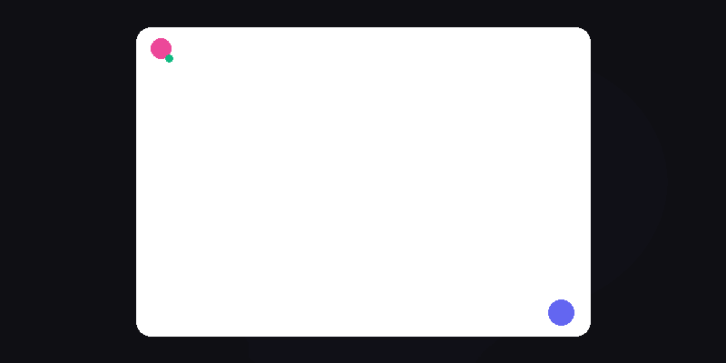

<div align="center">


<br>
<br>

# 🌌 Nuxt Community

### 小红书风格的全栈社区平台 · 博客 / 社交 / 实时通信 / 媒体管理

<br>

> 融合小红书的内容消费体验、微博的社交关系链与微信的实时私信能力 ——
> 基于 **Nuxt 3** 全栈框架，采用 **玻璃拟态** 设计语言，零数据库开箱即用。

<br>

<a href="https://www.nuxt.com"></a>
<a href="https://vuejs.org"></a>
<a href="https://antdv.com"></a>
<br>
<a href="https://pinia.vuejs.org"></a>
<a href="https://github.com/WuKongIM/WuKongIM"></a>
<a href="https://www.docker.com"></a>
<a href="#"></a>

</div>

<br>
<br>

## 🎬 功能演示

<div align="center">

<table>
<tr>
<td width="50%" align="center">

### 📌 社区瀑布流


小红书风格 masonry 布局 · 最新/热门/关注三栏切换 · 自动封面生成

</td>
<td width="50%" align="center">

### 📨 实时私信



WebSocket 即时推送 · 离线消息队列 · 上线自动消费 · 多端同步

</td>
</tr>
</table>

</div>

<br>

---

<br>

## ✨ 核心特性

<br>

<table>
<tr>
<td width="50%" valign="top">

### 🎨 玻璃拟态设计系统

- 全局 **Design Token** 体系（字体 / 配色 / 间距 / 圆角 / 阴影）
- 半透明毛玻璃面板悬浮于动态粒子背景之上
- **亮 / 暗** 双主题，SSR 安全无闪烁切换
- 入场动效 + 路由过渡 + `prefers-reduced-motion` 支持
- 响应式瀑布流（5→4→3→2 列自适应）

</td>
<td width="50%" valign="top">

### ⚡ 实时通信（双引擎）

- **WuKongIM**（主引擎）：企业级 IM 框架 · 群聊/私信/离线消息
- **easyjssdk** 客户端：WebSocket 长连接 · 自动重连 · 心跳保活
- **自有 WebSocket**（降级）：crossws 适配器 · 离线队列 · 多端同步
- 消息类型：**文本 / 图片 / GIF** 三种类型集成
- 群聊频道 `grp_<id>` · 私信频道 Person 自动路由

</td>
</tr>
<tr>
<td width="50%" valign="top">

### 📦 媒体管理

- 图片 + 视频持久存储到 `data/uploads/`
- **零依赖** 尺寸读取（解析 PNG/JPEG/GIF/WEBP/BMP 二进制头）
- HTTP Range 流式传输（206 Partial Content）
- 结构化元信息记录（`images.json`）
- 发帖自动生成主题封面（Canvas 渐变配色）

</td>
<td width="50%" valign="top">

### 🔐 安全认证

- **HMAC-SHA256** 签名 Cookie（`httpOnly` + `sameSite: lax`）
- **scrypt** 密码哈希 + 随机盐
- 无状态鉴权，无需 session 存储
- RBAC 角色控制（`admin` / `user`）
- 登录时序攻击防护（dummy scrypt 填充）

</td>
</tr>
</table>

<br>

---

<br>

## 🚀 功能总览

<br>

### 📝 社区博客系统

| 功能 | 描述 |
|:---:|:---|
| 📌 **发帖** | 富文本正文 · 多标签 · 最多 9 张配图 + 4 个视频混排上传 |
| 🔥 **瀑布流** | 小红书风格 masonry 布局 · 最新/热门/关注三栏切换 |
| 🖼️ **图片画廊** | 详情弹窗内多图轮播 · 缩略图导航 · 全屏预览 |
| 🎬 **视频播放** | 原生 `<video>` 播放器 · 流式 Range 加载 · 缩略图预览 |
| ❤️ **点赞** | 实时切换 · 不能给自己的帖子点赞 · 计数同步 |
| 🔖 **收藏夹** | 多收藏夹管理 · 帖子归类 · 独立页面浏览 |
| 💬 **评论系统** | 多级回复树 · 评论点赞 · 级联删除 · 实时计数 |

<br>

### 👥 社交关系

| 功能 | 描述 |
|:---:|:---|
| 🤝 **关注/粉丝** | 一键关注 · 粉丝/关注列表 · 关注动态 Feed |
| 👤 **用户主页** | 公开资料 · 自定义头像 + 背景横幅 · 统计面板 |
| 📨 **实时私信** | WuKongIM 即时推送 · 文本/图片/GIF 多类型 · 离线消息暂存 |
| 👥 **群聊系统** | 创建群组 · 邀请好友 · 群内实时聊天（文本/图片/GIF）|
| 🎁 **GIF 表情** | 内置 GIF 库 · 用户上传 GIF · 即时预览 · 全屏查看 |
| 🔔 **通知中心** | 未读消息计数 · 关注通知 · 群邀请 · 实时铃铛提醒 |
| ⚙️ **个人设置** | 头像上传 · 背景图设置 · 简介编辑 · 即时预览 |

<br>

### 🛠️ 后台管理

| 功能 | 描述 |
|:---:|:---|
| 📊 **仪表盘** | 数据统计 · 内容管理 · 用户管理 · 数字滚动动效 |
| 📂 **分类管理** | 分组/标签/内容 CRUD · 分页 · 搜索 |
| ⭐ **评分系统** | 1-5 星评分 · 应用推荐 · 均分统计 |

<br>

---

<br>

## 🏗️ 技术架构

```
my-nuxt-demo/
├── 📂 pages/                  # 页面路由（文件即路由）
│   ├── index.vue             #   落地页（生成式 Hero + 粒子动画）
│   ├── community.vue         #   社区瀑布流
│   ├── collections.vue       #   收藏夹
│   ├── settings.vue          #   个人信息设置
│   ├── user/[id].vue         #   用户公开主页
│   ├── application.vue       #   应用推荐
│   ├── admin.vue             #   后台管理（admin only）
│   ├── topic/[id].vue        #   专题页
│   └── art.vue               #   艺术展示
│
├── 📂 components/             # Vue 组件
│   ├── PostCard.vue          #   瀑布流卡片（图片/视频封面）
│   ├── PostDetailModal.vue   #   详情弹窗（画廊 + 评论 + 操作）
│   ├── PostEditorModal.vue   #   发帖编辑器（混合媒体上传）
│   ├── ChatPanel.vue         #   浮动私信面板（文本/图片/GIF）
│   ├── GroupChatPanel.vue    #   群聊浮动面板（群列表/聊天/建群/邀请）
│   ├── MessageContent.vue    #   统一消息渲染（文本/图片/GIF + 全屏预览）
│   ├── GifPicker.vue         #   GIF 表情选择器（内置库 + 用户上传）
│   ├── NotificationBell.vue  #   通知铃铛
│   ├── FollowButton.vue      #   关注按钮
│   ├── Header.vue            #   全局导航栏
│   ├── Sider.vue             #   侧边导航
│   ├── AuthModal.vue         #   登录/注册弹窗
│   ├── ContentDetail.vue     #   内容详情
│   └── Comments.vue          #   评论区（对接 API）
│
├── 📂 composables/           # Vue Composables（状态逻辑）
│   ├── useWuKongIM.ts        #   ★ WuKongIM 客户端单例（群聊/私信/多消息类型）
│   ├── useChatMedia.ts       #   ★ 聊天媒体上传 + GIF 库管理
│   ├── useGroups.ts          #   ★ 群组 CRUD + 邀请管理
│   ├── useGroupPanel.ts      #   ★ 群聊面板全局状态
│   ├── useMessages.ts        #   私信状态（文本/图片/GIF）
│   ├── useAuth.ts            #   认证状态 + 用户信息
│   ├── usePosts.ts           #   帖子 CRUD
│   ├── useCollections.ts     #   收藏夹管理
│   ├── useFollows.ts         #   关注关系
│   ├── useRealtime.ts        #   WebSocket 客户端（模块级单例）
│   ├── useChatPanel.ts       #   私信面板全局状态
│   ├── useSiteConfig.ts      #   站点配置
│   ├── useAvatar.ts          #   头像样式
│   └── useTheme.ts           #   主题切换
│
├── 📂 server/                # Nitro 服务端
│   ├── api/                  #   REST API（50+ 端点）
│   │   ├── messages/         #     私信（支持多消息类型持久化）
│   │   ├── groups/           #     ★ 群组 + 邀请 CRUD
│   │   ├── posts/            #     帖子 CRUD + 点赞
│   │   ├── comments/         #     评论 + 回复 + 点赞
│   │   ├── collections/      #     收藏夹
│   │   └── ...               #     认证/用户/关注/上传/配置
│   ├── routes/_ws.ts         #   WebSocket 入口（降级通道）
│   ├── utils/
│   │   ├── wukongim.ts       #   ★ WuKongIM HTTP API 客户端
│   │   ├── db.ts             #   JSON 数据层（原子写入 + 互斥锁）
│   │   ├── auth.ts           #   HMAC Cookie + scrypt 认证
│   │   ├── realtime.ts       #   WebSocket 广播
│   │   └── poster.ts         #   Canvas 封面生成
│   └── plugins/              #   seed-admin / config 热重载
│
├── 📂 docker/wukongim/       # ★ WuKongIM Docker Compose 部署
├── 📂 public/chat/gifs/      # ★ 内置 GIF 表情库
├── 📂 data/                  # JSON 持久化存储（无需数据库）
├── 📂 assets/css/            # 全局设计系统 Design Token
├── 📂 scripts/               # E2E 测试脚本
├── 📂 stores/                # Pinia 状态仓库
├── config.yml                # 唯一配置入口（热重载）
├── nuxt.config.ts            # Nuxt 配置
└── package.json
```

<br>

---

<br>

## 🏁 快速开始

<br>

### 环境要求

| 依赖 | 最低版本 |
|:---:|:---:|
| Node.js | `>= 18.0.0` |
| Docker | `>= 20.0`（启动 WuKongIM） |
| npm / pnpm / yarn | 任一包管理器 |

<br>

### 安装与启动

```bash
# 1️⃣ 克隆仓库
git clone git@github.com:kingdol666/nuxtProj.git
cd nuxtProj

# 2️⃣ 安装依赖
npm install

# 3️⃣ 启动 WuKongIM 即时通讯服务（Docker）
cd docker/wukongim
docker compose up -d
cd ../..

# 4️⃣ 启动开发服务器
npm run dev
```

<br>

> 🎉 启动成功后访问 **http://localhost:3000**
>
> WuKongIM 服务端口：
> - `5001` HTTP API · `5200` WebSocket · `5300` 管理后台

<br>


### 默认账号

| 角色 | 用户名 | 密码 | 权限 |
|:---:|:---:|:---:|:---|
| 🔑 管理员 | `admin` | `admin23` | 全部功能 + 后台管理 |
| 👤 普通用户 | 注册获取 | 注册设置 | 社区全部功能（无后台） |

> 管理员账号在首次启动时自动种子创建（幂等，不覆盖已有）

<br>

---

<br>

## 📖 使用指南

<br>

<table>
<tr>
<td width="33%" valign="top">

**📝 发布笔记**

点击「发布」按钮 → 上传图片/视频 → 填写标题正文 → 添加标签 → 发布

支持最多 9 个文件混合上传（图片 ≤8MB / 视频 ≤100MB）

</td>
<td width="33%" valign="top">

**👤 个人主页**

点击任意用户头像/昵称 → 查看公开主页 → 关注/私信

主页展示：头像、背景、简介、统计、笔记网格

</td>
<td width="33%" valign="top">

**📨 私信 / 群聊**

私信按钮或群聊按钮 → 打开面板 → 实时收发 **文本 / 图片 / GIF**

点击工具栏 📷 发送图片 · 🎁 选择 GIF 表情 · 离线消息自动暂存

</td>
</tr>
</table>

<br>

---

<br>

## 🔧 核心技术实现

<br>

<details>
<summary><b>🔐 无状态认证（HMAC Cookie + scrypt）</b></summary>

<br>

```typescript
// 签名：payload(base64url) + HMAC-SHA256 签名
const token = `${base64url(payload)}.${hmacSig}`

// 验证：常量时间比较签名 + 过期检查
function verifyToken(token: string): { uid: string } | null {
  const [b64, sig] = token.split('.')
  const expected = createHmac('sha256', secret).update(b64).digest('base64url')
  if (!timingSafeEqual(Buffer.from(sig), Buffer.from(expected))) return null
  // ... 过期检查
}
```

- **Cookie**: `httpOnly` + `sameSite: lax` + 30 天有效期
- **密码**: `scrypt` 哈希 + 随机盐（`salt:hash` 格式存储）
- **角色**: `admin` / `user`，后台管理仅 admin 可见
- **防枚举**: 登录失败时仍执行一次 dummy scrypt，消除用户名存在性时序差

</details>

<br>

<details>
<summary><b>📦 JSON 数据层（原子写入 + 互斥锁）</b></summary>

<br>

```typescript
// 事务性更新：lock → read → mutate → write
async function updateData<T, R>(kind: DataKind, fn: (items: T[]) => R): Promise<R> {
  return withLock(kind, async () => {
    const items = await readJson<T[]>(fileFor(kind))
    const result = await fn(items)        // 原地修改
    await writeJson(fileFor(kind), items) // 原子写入
    return result
  })
}
```

- **原子写入**: 临时文件 → rename（同文件系统原子操作）
- **互斥锁**: 每资源独立 `Promise` 链，序列化并发写入
- **容错**: 只读文件系统降级为 507 而非崩溃
- **向后兼容**: `ensureIds` 在写锁内安全回填缺失 ID
- **损坏隔离**: JSON 解析失败自动隔离坏文件，返回空集合不崩溃

</details>

<br>

<details>
<summary><b>⚡ WebSocket 实时通信</b></summary>

<br>

```
浏览器 ──ws://host/_ws──→ Nitro crossws 适配器
                              │
                    ┌─────────┴──────────┐
                    │  open(peer)         │
                    │  Cookie 认证        │
                    │  注册在线           │
                    │  消费离线队列       │
                    └─────────┬──────────┘
                              │
                    ┌─────────┴──────────┐
                    │  内存注册表          │
                    │  Map<userId, Set>   │
                    └────────────────────┘
```

- **认证**: WS 握手时浏览器自动携带 Cookie，`open` 钩子读取验证
- **离线队列**: 消息存储 `delivered: false`，上线时先推送再标记，断线不丢失
- **多端支持**: 同一用户可多连接，消息广播到所有活跃端
- **心跳**: 25 秒 ping/pong，断线 3 秒自动重连
- **客户端单例**: 模块级 WebSocket + 定时器，多组件共享单连接

</details>

<details>
<summary><b>💬 WuKongIM 即时通讯（双引擎架构）</b></summary>

<br>

```
浏览器 ──ws:5200──→ WuKongIM (easyjssdk)     ← 主通道：群聊/私信/多消息类型
                          │
                ┌─────────┴──────────┐
                │  Person 频道 = uid   │   私信：channelType=1
                │  Group 频道 = grp_id │   群聊：channelType=2
                │  离线消息自动补投     │
                └─────────┬──────────┘
                          │
浏览器 ──ws:_ws────→ 自有 crossws 适配器      ← 降级通道：通知/配置推送
```

**消息协议**（应用层）：
```typescript
type MsgPayload =
  | { type: 1; text: string }                          // 文本
  | { type: 2; url: string; w?: number; h?: number }   // 图片
  | { type: 3; url: string }                           // GIF
```

- **主引擎**: WuKongIM 处理群聊和私信的实时投递 + 离线消息存储
- **降级通道**: 自有 WebSocket 在 WuKongIM 不可用时接管推送
- **双写策略**: 私信同时走 WuKongIM 实时投递 + HTTP API 持久化（保证历史可查）
- **群聊频道**: 创建群组时自动调用 WuKongIM API 建 `grp_<id>` 频道并同步订阅者
- **GIF 库**: 内置 3 个 GIF + 用户上传，选择器集成在私信/群聊输入区

</details>

<br>

<details>
<summary><b>🎬 媒体存储（图片 + 视频）</b></summary>

<br>

```typescript
interface ImageMeta {
  id: string
  filename: string          // 磁盘文件名
  originalName: string      // 原始文件名
  mimeType: string          // image/jpeg, video/mp4, ...
  kind: 'image' | 'video'   // 媒体类型
  size: number              // 字节数
  width: number             // 像素宽
  height: number            // 像素高
  duration: number          // 视频时长（秒）
  userId: string            // 上传者
  purpose: 'post' | 'avatar' | 'background' | 'other'
  url: string               // 公开访问路径
  createdAt: number
}
```

- **持久化**: 文件存储于 `data/uploads/`，元信息记录于 `data/images.json`
- **零依赖尺寸读取**: 直接解析 PNG/JPEG/GIF/WEBP/BMP 二进制头部
- **视频流式传输**: HTTP Range 请求（含后缀范围 `bytes=-N`），可拖拽跳转
- **安全**: `X-Content-Type-Options: nosniff` + 路径穿越防护 + 上传体积预检
- **用途标记**: `purpose` 字段区分帖子配图/头像/背景，便于管理

</details>

<br>

<details>
<summary><b>⚙️ 配置系统（config.yml 热重载）</b></summary>

<br>

```yaml
# config.yml — 项目唯一配置入口
server:
  host: 0.0.0.0
  devPort: 3000
  prodPort: 3000

data:
  dataDir: ""                          # 空 = <项目根>/data
  authSecret: "change-in-production"   # HMAC 签名密钥
  cookieMaxAgeDays: 30

limits:
  posts: { pageSize: 20, titleMax: 100, contentMax: 5000 }
  uploads: { maxMedia: 9, maxVideos: 4, maxImageSizeMB: 8 }
  comments: { textMax: 2000 }

realtime:
  heartbeatIntervalMs: 25000
  reconnectDelayMs: 3000

features:
  enableSignup: true
  enableGuestBrowse: true

wukongim:
  enabled: true                    # 启用 WuKongIM 即时通讯
  wsURL: "ws://localhost:5200"     # 浏览器 easyjssdk 连接地址
  apiURL: "http://localhost:5001"  # 服务端 HTTP API 地址
  managerToken: ""                 # 管理者 token（开启 token-auth 时必填）

branding:

- **热重载**: 修改 `config.yml` 并保存 → 运行中服务自动检测并即时生效
- **PATCH 语义**: `PUT /api/config` 只需发送变更字段，未提供字段保持不变
- **防误删**: 非对象请求体不会重置配置
- **分级**: 启动键（端口/目录/密钥）需重启，其余热键即时生效
- **鲁棒**: 文件缺失或格式错误回退默认值，绝不崩溃

</details>

<br>

---

<br>

## 📊 API 端点一览

<br>

| 模块 | 方法 | 路径 | 说明 |
|:---:|:---:|:---|:---|
| **认证** | POST | `/api/auth/login` | 登录 |
| | POST | `/api/auth/register` | 注册 |
| | POST | `/api/auth/logout` | 登出 |
| | GET | `/api/auth/me` | 当前用户 |
| **帖子** | GET | `/api/posts` | 列表（tag/keyword/userId 过滤） |
| | POST | `/api/posts` | 创建（images + videos + 自动封面） |
| | GET | `/api/posts/[id]` | 详情 |
| | PUT | `/api/posts/[id]` | 更新 |
| | DELETE | `/api/posts/[id]` | 删除 |
| | POST | `/api/posts/[id]/like` | 点赞切换 |
| **评论** | GET | `/api/comments` | 列表（contentId/targetType 过滤） |
| | POST | `/api/comments` | 创建（含回复， targetType: content/post） |
| | DELETE | `/api/comments/[id]` | 删除（级联，计数精确扣减） |
| | POST | `/api/comments/[id]/like` | 点赞 |
| **收藏** | GET | `/api/collections` | 用户收藏夹列表 |
| | POST | `/api/collections` | 创建收藏夹 |
| | DELETE | `/api/collections/[id]` | 删除（多收藏夹 collectedBy 安全） |
| | POST | `/api/collections/[id]/items` | 收藏/取消帖子 |
| **关注** | GET | `/api/follows` | 粉丝/关注列表（userId + dir/check） |
| | POST | `/api/follows` | 关注/取关 |
| **私信** | GET | `/api/messages` | 会话列表/单会话 |
| | POST | `/api/messages` | 发送消息（text/msgType/mediaUrl 多类型） |
| | POST | `/api/messages/read` | 标记已读 |
| | GET | `/api/messages/unread` | 未读计数 |
| **群组** | GET | `/api/groups` | 我的群组列表 |
| | POST | `/api/groups` | 创建群组（自动建 WuKongIM 频道） |
| | GET | `/api/groups/[id]` | 群组详情 + 成员 |
| | DELETE | `/api/groups/[id]` | 退出/解散群组 |
| | GET | `/api/groups/invites` | 待处理邀请 |
| | POST | `/api/groups/invites` | 邀请好友（需好友关系） |
| | POST | `/api/groups/invites/[id]` | 接受/拒绝邀请 |
| **用户** | GET | `/api/users/[id]/profile` | 公开资料 + 统计 |
| | PUT | `/api/users/profile` | 更新个人资料 |
| **媒体** | POST | `/api/upload` | 上传图片/视频（Content-Length 预检） |
| | GET | `/api/uploads/[file]` | 媒体服务（Range + nosniff） |
| | GET | `/api/images` | 元信息列表 |
| **Feed** | GET | `/api/feed/following` | 关注动态 |
| **配置** | GET | `/api/config` | 获取配置 |
| | PUT | `/api/config` | 更新配置（admin, PATCH 语义） |
| **WebSocket** | WS | `/_ws` | 降级实时通信（私信/通知/配置推送） |
| **WuKongIM** | WS | `ws:5200` | 主实时通道（群聊/私信/多消息类型） |
| | HTTP | `http:5001` | 服务端 API（建群/同步订阅者） |

<br>

---

<br>

## 🔌 生产部署

<br>

```bash
# 构建生产版本
npm run build

# 本地预览生产构建
npm run preview

# 生成静态站点（SSG）
npm run generate
```

<br>

### 环境变量

| 变量 | 说明 | 默认值 |
|:---|:---|:---:|
| `NUXT_DATA_DIR` | 数据存储目录（需可写） | `<cwd>/data` |
| `NUXT_AUTH_SECRET` | HMAC 签名密钥（**生产必须修改**） | 内置开发密钥 |

<br>

> ⚠️ **生产环境务必设置 `NUXT_AUTH_SECRET`**，否则 Cookie 签名可被伪造。

<br>

---

<br>

## 🎨 设计系统

<br>

项目使用统一的 **Design Token** 体系，定义于 `assets/css/main.css`：

| 类别 | Token | 值 |
|:---|:---|:---|
| 主色 (Indigo) | `--accent` | `#6366f1` (light) / `#818cf8` (dark) |
| 字体 | `--font-sans` | Inter + Noto Sans SC |
| 圆角 | `--radius-*` | 8px → 12px → 16px → 22px |
| 阴影 | `--shadow-*` | xs → sm → md → lg |
| 玻璃材质 | `.glass` | `backdrop-blur(20px)` + 半透明 |
| 动效缓动 | `--ease-*` | `cubic-bezier(0.16, 1, 0.3, 1)` |
| 暗色模式 | `html.dark` | 自动切换全部 token |
| 无障碍 | `:focus-visible` | 键盘焦点可见 + `aria` 标签 |

<br>

---

<br>

<div align="center">

## 📜 许可证

MIT License © 2025

<br>

---

<br>

**⭐ 如果这个项目对你有帮助，欢迎 Star**

<br>

<sub>Built with ❤️ using Nuxt 3 · Vue 3 · Ant Design Vue · Pinia · WuKongIM · WebSocket</sub>

</div>
